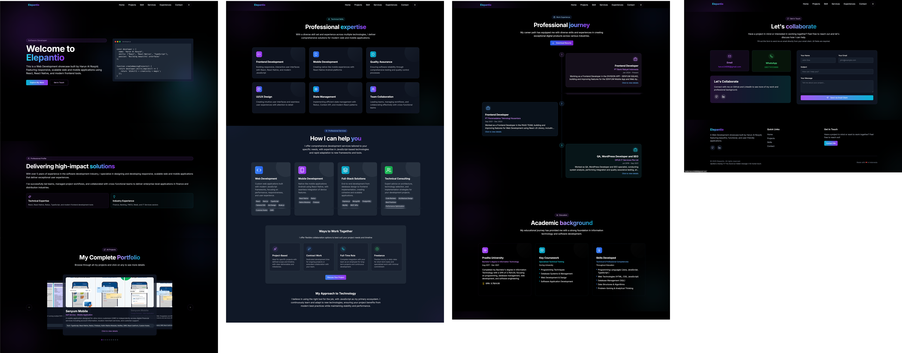
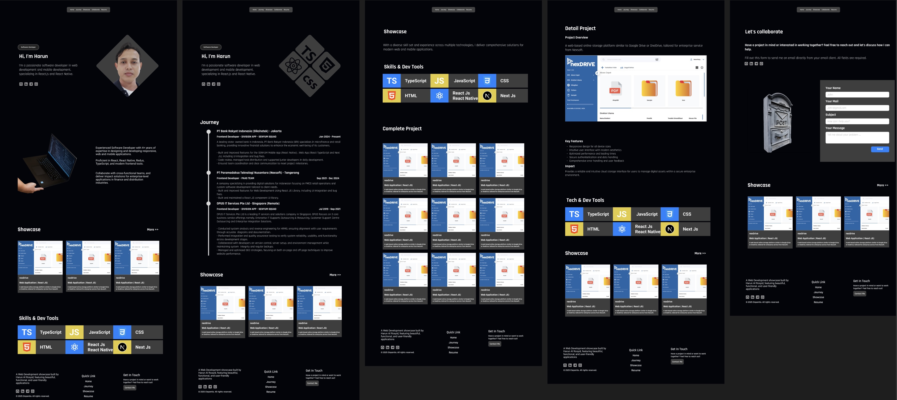
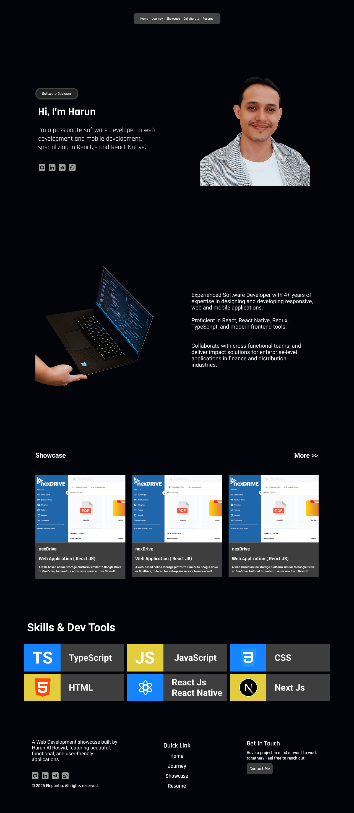
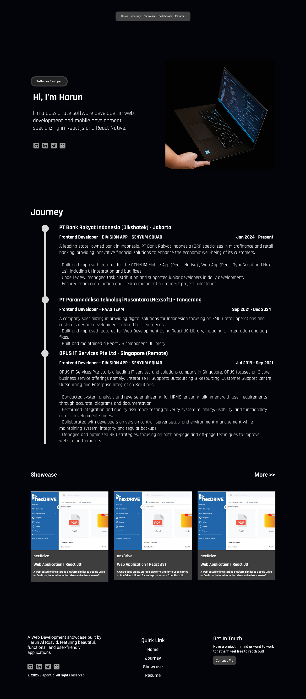
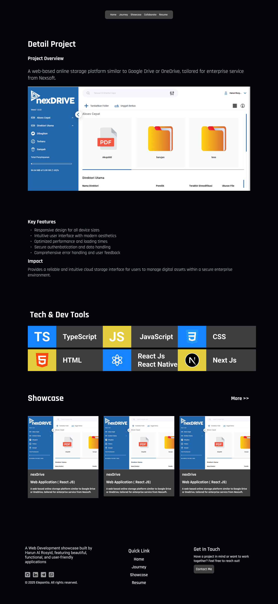

# harunalrosyid.com

This is my personal website, Revamp from [elepantio.com](https://elepantio.com).
That being built since 2025.

Lets to visit my website :
[harunalrosyid.com](https://harunalrosyid.com)

I remake my personal website, to get looks to more clean, simple, with consistent layout.

## My previous Personal Website



## Final Design



# Inspirations

Honestly i'm not designer. I can't create fresh and awesome design. Cause, my focus is create and development application product.

To build good design for my Personal Website, Some element or component is imitation from other website.

My list website inspiration:

- [elepantio.com](https://elepantio.com)
- [theodorusclarence.com](https://theodorusclarence.com)
- [brittanychiang.com](https://brittanychiang.com)
- [kentcdodds.com](https://kentcdodds.com)

# Page

I just create 5 page for visitor to learn about me.

```bash
    Site Map

    Personal Website (harunalrosyid.com)
    |__Home
    |__Journey
    |__Showcase
    |  |__Project Detail
    |__Lets
```

## Home
Page Link [Home](https://harunalrosyid.com)

I create 5 section on Home page. 

1. Introduction
2. Short Experience
3. Showcase
4. Skills
5. Footer

Preview Home:



## Journey

I create 4 section on Journey page. 

1. Introduction
2. Journey
3. Showcase
4. Footer

Preview Home:



## Showcase
Page Link [Showcase](https://harunalrosyid.com/showcase)

I create 4 section on Showcase page. 

1. Decription
2. Skills
3. All Showcase
4. Footer

Preview Showcase:


## Project Detail
Page Link [Project Detail](https://harunalrosyid.com)

I create 5 section on Project Detail page. 

1. Decription
2. Detail Project
3. Tech Stack
4. Showcase
5. Footer

Preview Project Detail:



## Collaborate
Page Link [Collaborate](https://harunalrosyid.com/collaborate)

I create 4 section on Collaborate page. 

1. Decription
2. Contact Form
3. Showcase
4. Footer

Preview Collaborate:


# Section