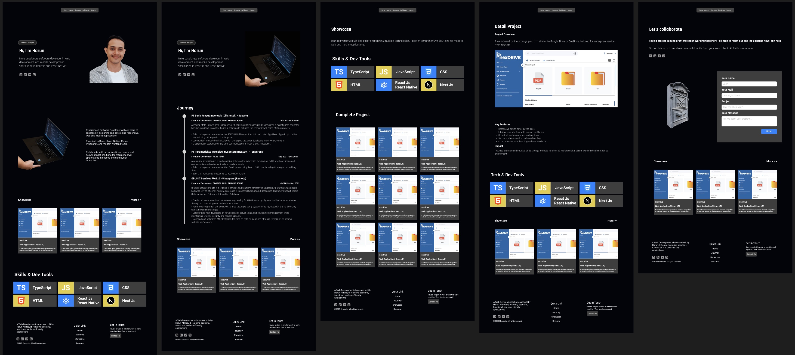

# harunalrosyid.com

This is my personal website, Revamp from [elepantio.com](https://elepantio.com).
That being built since 2025.

Lets to visit my website :
[harunalrosyid.com](https://harunalrosyid.com)

I remake my personal website, to get looks to more clean, simple, with consistent layout.

## My previous Personal Website


## Final Design



# Inspirations

Honestly i'm not designer. I can't create fresh and awesome design. Cause, my focus is create and development application product.

To build good design for my Personal Website, Some element or component is imitation from other website.

My list website inspiration:

- [elepantio.com](https://elepantio.com)
- [theodorusclarence.com](https://theodorusclarence.com)
- [brittanychiang.com](https://brittanychiang.com)
- [kentcdodds.com](https://kentcdodds.com)

# Page

I just create 5 page for visitor to learn about me.

```bash
    Site Map

    Personal Website (harunalrosyid.com)
    |_Home
    |_Journey
    |_Showcase
    | |_Project Detail
    |_ Lets
```

## Home

## Journey

## Showcase

## Project Detail

## Collaborate
