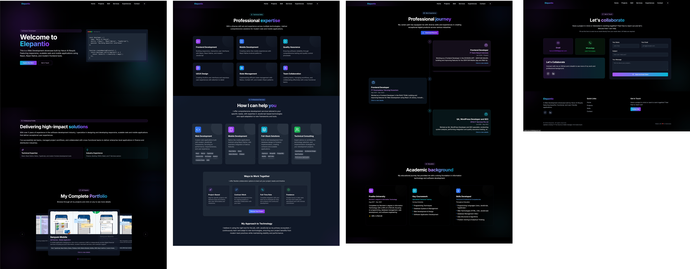
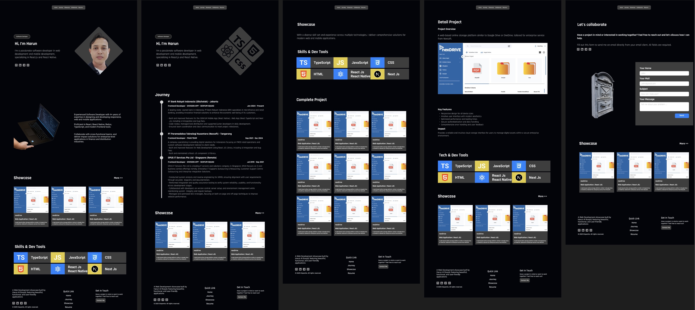
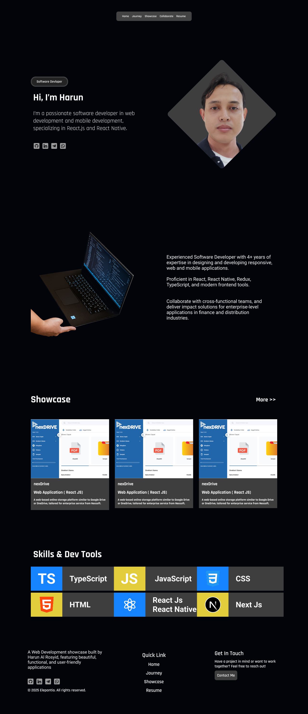
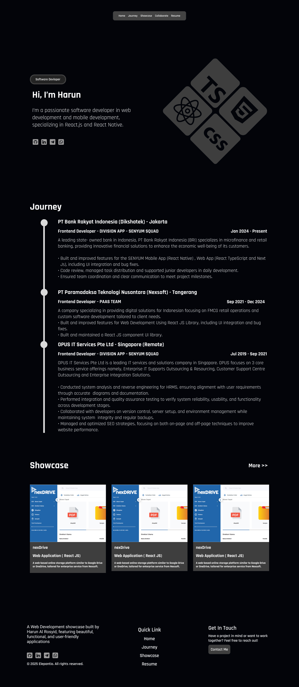
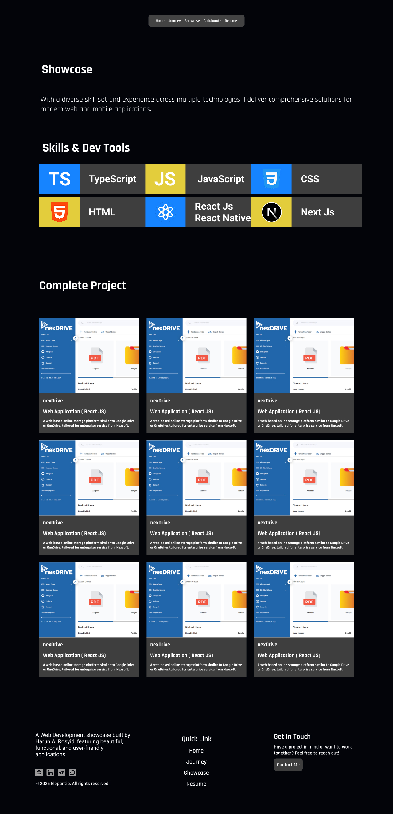
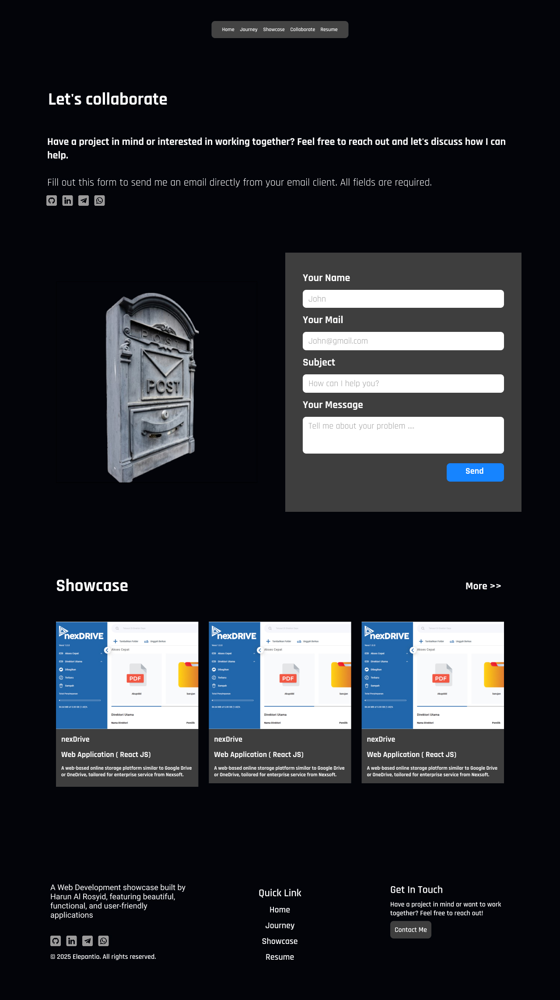

**Table Of Content**
- [harunalrosyid.com](#harunalrosyidcom)
  - [My previous Personal Website](#my-previous-personal-website)
  - [Final Design](#final-design)
- [Inspirations](#inspirations)
- [Page](#page)
  - [Home](#home)
  - [Journey](#journey)
  - [Showcase](#showcase)
  - [Project Detail](#project-detail)
  - [Collaborate](#collaborate)
- [Section](#section)
- [Skill](#skill)
- [Social Media and Contact](#social-media-and-contact)

# harunalrosyid.com

This is my personal website, Revamp from [elepantio.com](https://elepantio.com).
That being built since 2025.

Visit my website here :
[harunalrosyid.com](https://harunalrosyid.com)

I remake my personal website, to get looks to more clean, simple, with consistent layout.

## My previous Personal Website



## Final Design



# Inspirations

Honestly, i'm not designer. I can't create fresh and awesome design. Because my focus is building and developing applications.

To build good design for my Personal Website, Some element or component is imitation from other website.

My list website inspiration:

- [elepantio.com](https://elepantio.com)
- [theodorusclarence.com](https://theodorusclarence.com)
- [brittanychiang.com](https://brittanychiang.com)
- [kentcdodds.com](https://kentcdodds.com)

# Page

I just create 5 page for visitor to learn about me.

```bash
    Site Map

    Personal Website (harunalrosyid.com)
    |__Home
    |__Journey
    |__Showcase
    |  |__Project Detail
    |__Lets
```

## Home

Page Link [Home](https://harunalrosyid.com)

I create 5 section on Home page.

1. Introduction
2. Short Experience
3. Showcase
4. Skills
5. Footer

Preview Home:



## Journey

This page explain about current and past my experience.

I create 4 section on Journey page.

1. Introduction
2. Journey
3. Showcase
4. Footer

Preview Journey:



## Showcase

Page Link [Showcase](https://harunalrosyid.com/showcase)

This page for explain about current and pass my complete project.

I create 4 section on Showcase page.

1. Description
2. Skills
3. All Showcase
4. Footer

Preview Showcase:



## Project Detail

Page Link [Project Detail](https://harunalrosyid.com)

This page to more detail about project.

I create 5 section on Project Detail page.

1. Description
2. Detail Project
3. Tech Stack
4. Showcase
5. Footer

Preview Project Detail:


## Collaborate

Page Link [Collaborate](https://harunalrosyid.com/collaborate)

This page include Contact Form to request collaboration and link social media.

I create 4 section on Collaborate page.

1. Description
2. Contact Form
3. Showcase
4. Footer

Preview Collaborate:



# Section

1. Introduction : short introduction about me.
2. Short Experience : short experience about me.
3. Showcase : shortcut project list.
4. Skills : tell my skill and tools development.
5. Journey : detail my journey as developer from first job and current job
6. Description : decription about page.
7. All Showcase : all project list.
8. Detail Project : detail project.
9.  Tech Stack : tech stack of project.
10. Contact Form : contact form via email.
11. Footer : footer include tagline, social link and quick link navigation.

#  Skill
- React.js, React Native, HTML, CSS, JavaScript, Tailwind CSS
- Redux, SWR, Custom Hooks, Ant Design, MUI, Shadcn
- React Native, Native Module (Kotlin), Firebase Cloud Messaging (FCM), Notifee
- PHP, Laravel, MySQL, PostgreSQL


# Social Media and Contact

| Social Media / Contact | Account / Link                                                |
| :---------------------- | -------------------------------------------------------------: |
| Github                 | [harunalrosyid](https://github.com/harunalrosyid)             |
| Linkedin               | [harun-alrosyid](https://www.linkedin.com/in/harun-alrosyid/) |
| Telegram               | [harunalrosyid](https://t.me/harunalrosyid)                   |
| WhatsApp               | [6285774133886](https://wa.me/6285774133886)                  |
| Email                  | [harun24896@gmail.com](mailto:harun24896@gmail.com)           |
